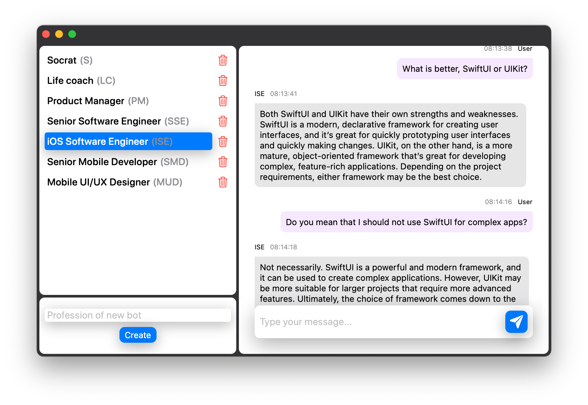

  

  <h3 align="center">CompanionAI</h3>

  

    Empower yourself with any custom AI companion for a better life.
  

    
    
    
    
    

CompanionAI is a chat application that allows users to communicate with a team of AI personas designed for specific tasks. These AI personas can assist with a variety of tasks, such as product management, data analysis, and more.

## Installation

Run `make build_release` and CompanionAI.app will be ready for use in the repository root folder.

After launch it will create a config file at path `~/Library/Application Support/CompanionAI/config.json`. You should set OpenAI API key in this file.

## 🗺 Roadmap

- Generate context from chat history that will be sent with every prompt

## 💻 Developing

### Requirements

- Xcode 14.0+
- [Tuist](https://github.com/tuist/tuist)

## 🏷 License

`CompanionAI` is available under the MIT license. See the [LICENSE file](./LICENSE) for more info.
